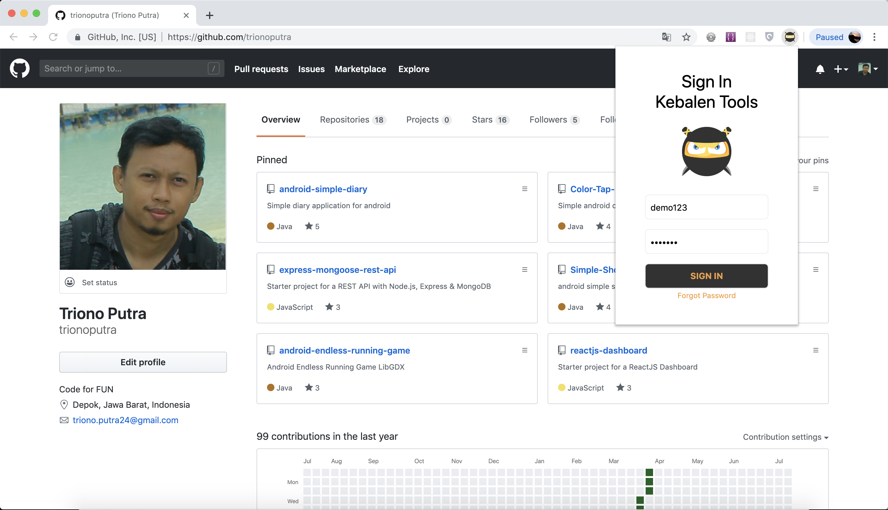
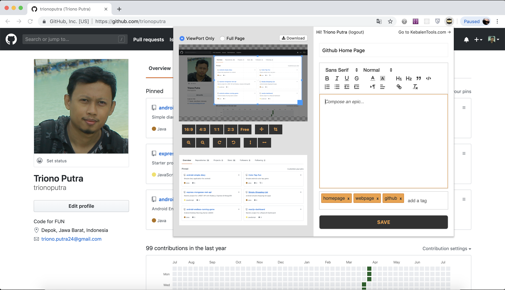

# Chrome Extension - Web Clipper

Aplikasi ini berfungsi bukan hanya sebagai web clipper biasa, melainkan digunakan sebagai User Guide Creator berbasis cloud.
hasil clipping akan disimpan dicloud yang nantinya akan ada dashboard yang menampilkan semua list clipping dan bisa diexport kedalam bentuk doc/docx menjadi sebuah user guide atau dokumentasi website

### Halaman login
</img>
 
### Halaman Utama
</img>

#### libs
* [JQuery](https://jquery.com)
* [html2canvas](https://html2canvas.hertzen.com)
* [JQuery Cropper](https://fengyuanchen.github.io/jquery-cropper/)
* [JQuery TagsInput](http://xoxco.com/projects/code/tagsinput/)
* [Quilljs](https://quilljs.com)
